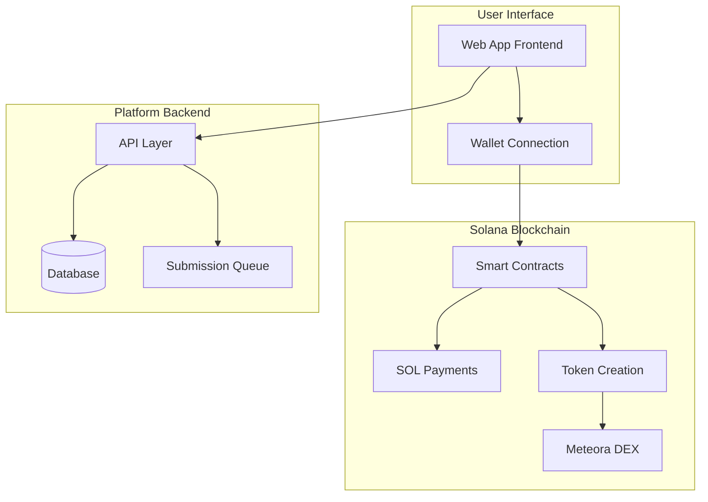
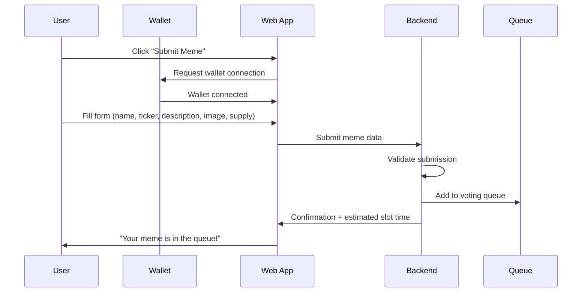
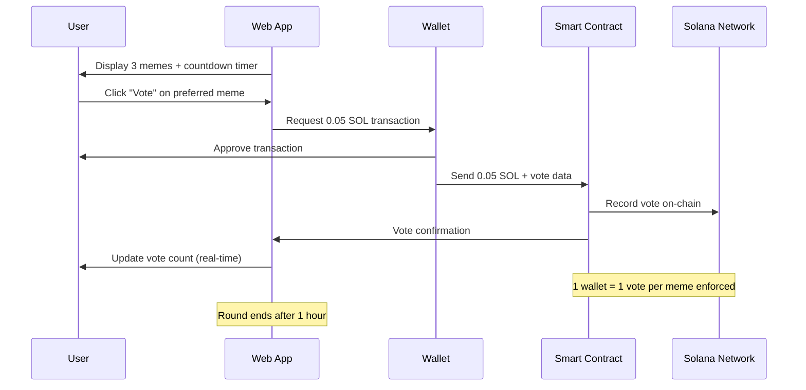
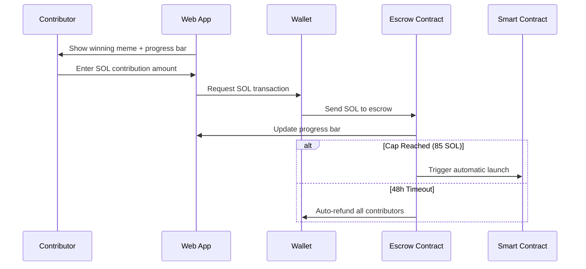
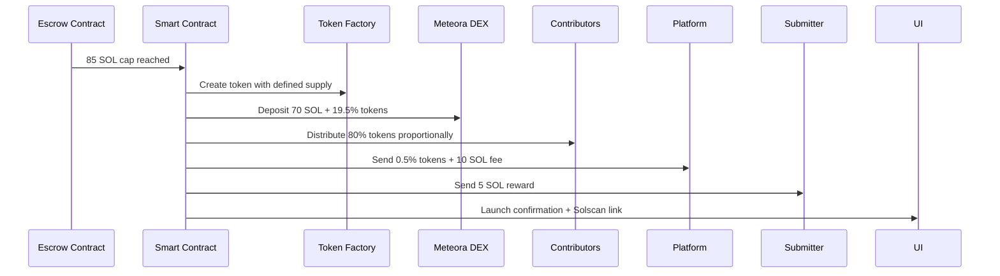
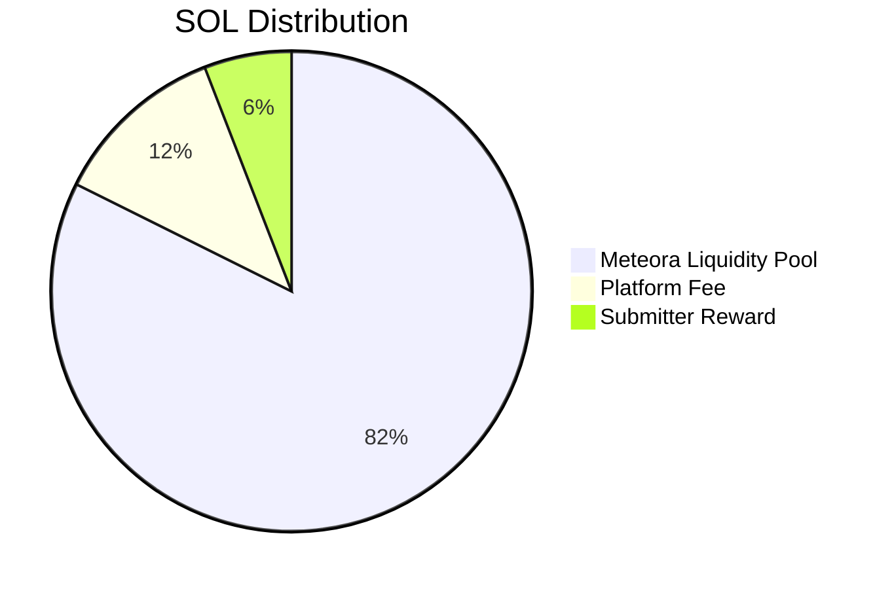
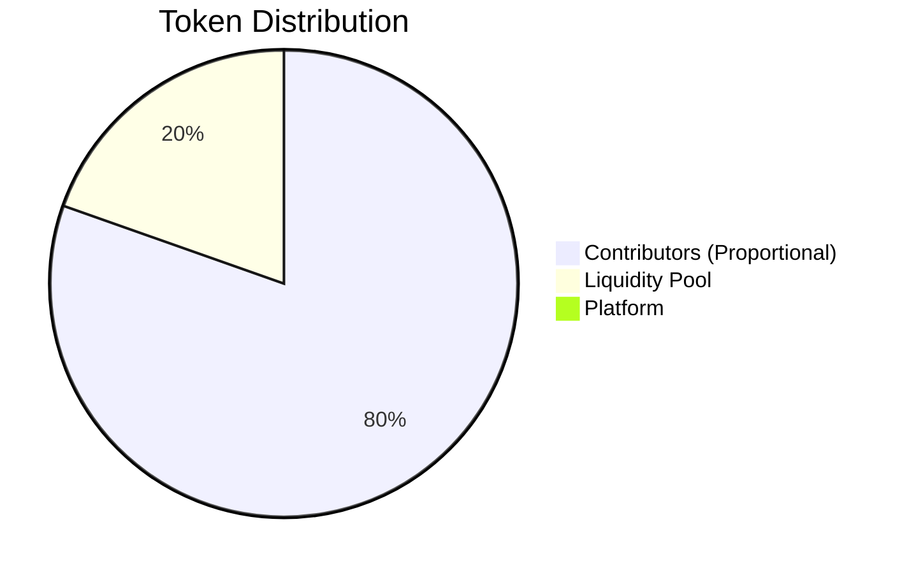
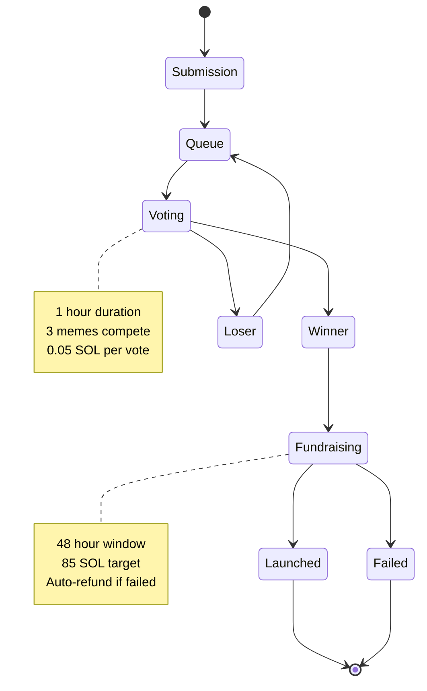

# Vestor

**Community-Voted Meme Coin Launchpad on Solana**

Vestor operates like "American Idol for meme coins" — the community submits, votes on, and funds meme coin launches on Solana. Each 1-hour voting round determines which meme gets funded, with automatic token creation and Meteora liquidity pool seeding.

## Data Flow & Architecture

### System Overview



### Core User Flows

#### 1. Meme Submission Flow



#### 2. Voting Process Flow



#### 3. Fundraising Flow



#### 4. Automatic Token Launch Flow



### Economic Distribution

#### SOL Raise Distribution (85 SOL Cap)



#### Token Supply Distribution



### Platform States & Transitions



### Key Parameters

| Parameter            | Value             | Description              |
| -------------------- | ----------------- | ------------------------ |
| **Voting Duration**  | 1 hour            | Fixed round length       |
| **Voting Cost**      | 0.05 SOL          | Per vote, anti-spam      |
| **Voting Rule**      | 1 wallet = 1 vote | Anti-manipulation        |
| **Memes per Round**  | 3                 | Simultaneous competition |
| **Fundraise Cap**    | 85 SOL            | Target raise amount      |
| **Fundraise Window** | 48 hours          | Time limit for funding   |
| **Submission Fee**   | Free              | No cost to submit        |

### Security Features

- **On-chain voting**: All votes recorded on Solana blockchain
- **Smart contract automation**: No manual intervention in launches
- **Anti-manipulation**: 1 wallet = 1 vote rule enforced at contract level
- **Automatic refunds**: Failed raises refund contributors automatically
- **Transparent economics**: All distributions visible and automated

---

This is a [Next.js](https://nextjs.org) project bootstrapped with [`create-next-app`](https://nextjs.org/docs/app/api-reference/cli/create-next-app).

## Getting Started

First, run the development server:

```bash
npm run dev
# or
yarn dev
# or
pnpm dev
# or
bun dev
```

Open [http://localhost:3000](http://localhost:3000) with your browser to see the result.

You can start editing the page by modifying `app/page.tsx`. The page auto-updates as you edit the file.

This project uses [`next/font`](https://nextjs.org/docs/app/building-your-application/optimizing/fonts) to automatically optimize and load [Geist](https://vercel.com/font), a new font family for Vercel.

## Learn More

To learn more about Next.js, take a look at the following resources:

- [Next.js Documentation](https://nextjs.org/docs) - learn about Next.js features and API.
- [Learn Next.js](https://nextjs.org/learn) - an interactive Next.js tutorial.

You can check out [the Next.js GitHub repository](https://github.com/vercel/next.js) - your feedback and contributions are welcome!

## Deploy on Vercel

The easiest way to deploy your Next.js app is to use the [Vercel Platform](https://vercel.com/new?utm_medium=default-template&filter=next.js&utm_source=create-next-app&utm_campaign=create-next-app-readme) from the creators of Next.js.

Check out our [Next.js deployment documentation](https://nextjs.org/docs/app/building-your-application/deploying) for more details.
